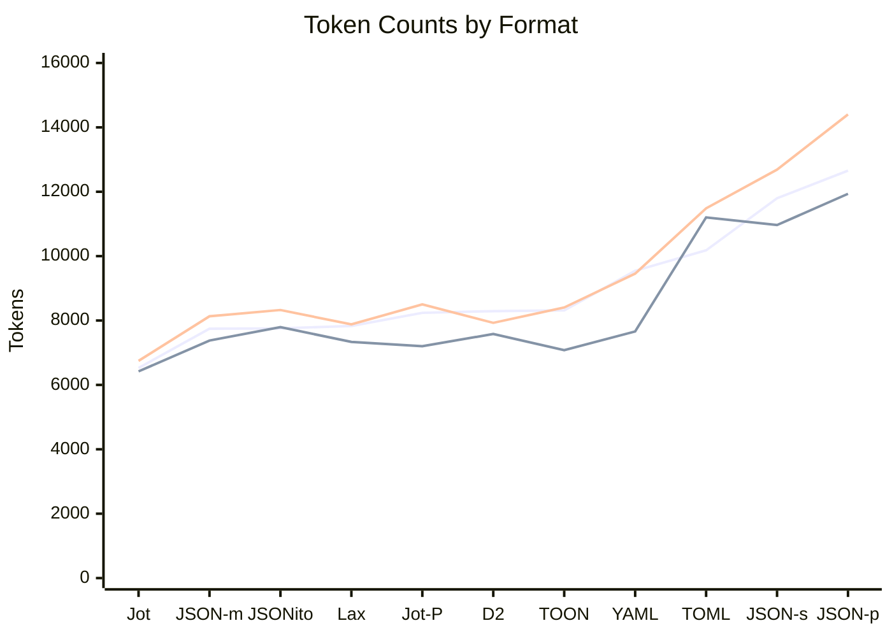

# Encoding Format Comparison

Token counts measured on Qwen3-Coder-30b. For LLM systems, **tokens matter more than bytes**.

## Recommendation

**Use Jot** for LLM contexts — unquoted keys save ~19% tokens while achieving **94% LLM encoding accuracy**.

## LLM Encoding Accuracy

Tested Qwen3-Coder-30b 8-bit on encoding JSON → Jot (3 runs per document, 17 docs):

| Format Variant         | Semantic Accuracy | Notes               |
|------------------------|------------------:|---------------------|
| **Unquoted keys only** |        **94.1%**  | Simple, one rule    |
| Tables + unquoted      |            76.5%  | Models misuse tables|
| Tables + key folding   |           ~70.6%  | Over-folding issues |

Simpler formats are easier for LLMs to learn. The only failure (routes.json) was due to output truncation on a 6KB file with complex regex patterns.

## Token Efficiency

<!-- CHART_START -->

<!-- CHART_END -->

### Compact Formats

For machine-to-machine or LLM contexts where readability isn't required.

<!-- COMPACT_START -->
| Format                                              | Qwen           | Legacy         | Claude         | Bytes          |
|-----------------------------------------------------|---------------:|---------------:|---------------:|---------------:|
| **[Jot](jot/)**                                     |   6,525 (-16%) |   6,420 (-13%) |   6,747 (-17%) |  16,621 (-28%) |
| [JSON](https://www.json.org/) (mini)                |          7,748 |          7,377 |          8,132 |         23,119 |
| [JSONito](https://github.com/creationix/jsonito)    |    7,757 (+0%) |    7,794 (+6%) |    8,327 (+2%) |  14,059 (-39%) |
| [Lax](lax/)                                         |    7,832 (+1%) |    7,335 (-1%) |    7,881 (-3%) |   20,932 (-9%) |
| [D2](https://github.com/creationix/d2)              |    8,292 (+7%) |    7,582 (+3%) |    7,928 (-3%) |  17,328 (-25%) |
<!-- COMPACT_END -->

### Pretty-Printed Formats

For human-readable output or when LLMs need to read/write structured data.

<!-- PRETTY_START -->
| Format                                              | Qwen           | Legacy         | Claude         | Bytes          |
|-----------------------------------------------------|---------------:|---------------:|---------------:|---------------:|
| **[Jot](jot/) (pretty)**                            |   8,239 (-35%) |   7,204 (-40%) |   8,500 (-41%) |  23,676 (-41%) |
| [TOON](toon/)                                       |   8,315 (-34%) |   7,079 (-41%) |   8,405 (-42%) |  22,780 (-43%) |
| [YAML](https://yaml.org/)                           |   9,543 (-25%) |   7,661 (-36%) |   9,456 (-34%) |  26,757 (-33%) |
| [TOML](https://toml.io/)                            |  10,180 (-20%) |   11,204 (-6%) |  11,485 (-20%) |  28,930 (-27%) |
| [JSON](json/smart-json.ts) (smart)                  |   11,799 (-7%) |   10,966 (-8%) |  12,687 (-12%) |  32,657 (-18%) |
| [JSON](https://www.json.org/) (pretty)              |         12,656 |         11,937 |         14,403 |         39,884 |
<!-- PRETTY_END -->

## Format Descriptions

### Jot

JSON with unquoted keys. Simple rule, high LLM accuracy.

```jot
{name:Alice,age:30,items:[a,b,c],active:true}
```

Features:

- **Unquoted keys**: Keys don't need quotes unless they contain special characters
- **Minimal string quoting**: Only quote strings containing unsafe chars (`: , { } [ ] "`), reserved words, or whitespace
- **94% LLM encoding accuracy**: Simple format that LLMs can reliably learn and produce

### Lax

Relaxed JSON: no commas, no key quotes. **0% vs JSON**.

```lax
{name:"Alice" age:30 items:["a" "b" "c"]}
```

### TOON

YAML-like with count guards and table syntax. **-1% vs JSON**.

```yaml
users[2]{id,name}:
  1,Alice
  2,Bob
```

## Full Results

| Format      | Small | Medium | Large | Hikes | Chat | Metrics | Package | Issue | Irregular | Users-50 | Logs  | Firewall | Products | Routes |
|-------------|------:|-------:|------:|------:|-----:|--------:|--------:|------:|----------:|---------:|------:|---------:|---------:|-------:|
| **Jot**     |    44 |     70 |   244 |   111 |   67 |     100 |      85 |    78 |        63 |      662 | 2,043 |      666 |      693 |  1,220 |
| JSONito     |    45 |    103 |   312 |   158 |   86 |      89 |     101 |    89 |        59 |    1,234 | 1,941 |      919 |      846 |  1,426 |
| Lax         |    45 |     92 |   265 |   144 |   79 |     117 |      95 |    88 |        69 |    1,229 | 2,166 |      785 |      876 |  1,442 |
| JSON (mini) |    48 |     97 |   266 |   158 |   76 |     117 |      97 |    88 |        68 |    1,279 | 2,108 |      827 |      866 |  1,459 |
| TOON        |    50 |     83 |   313 |   122 |   68 |     110 |     104 |    90 |        88 |      763 | 2,492 |    1,073 |      954 |  1,574 |
| D2          |    55 |    104 |   316 |   173 |   80 |     138 |      90 |    97 |        81 |    1,202 | 2,092 |      894 |      994 |  1,536 |
| YAML        |    56 |    123 |   327 |   187 |   82 |     140 |     104 |    98 |        87 |    1,597 | 2,487 |    1,029 |    1,095 |  1,696 |
| TOML        |    56 |    118 |   377 |   189 |   84 |     139 |     104 |    99 |        86 |    1,625 | 2,498 |    1,495 |    1,114 |  1,790 |

### Test Data

- **small**: Config object (6 fields, 3-item array)
- **medium**: User list (3 records + metadata)
- **large**: Kubernetes deployment spec (nested config)
- **hikes**: Tabular records (3 hikes with uniform schema)
- **chat**: LLM conversation (3 messages, text-heavy)
- **metrics**: Time series (5 data points, numeric-heavy)
- **package**: npm manifest (flat object with nested deps)
- **issue**: GitHub issue (mixed nesting, labels array)
- **irregular**: Event log (objects with different keys)
- **users-50**: 50 user records (uniform schema, table-friendly)
- **logs**: 50 log entries (semi-uniform with varying fields)
- **firewall**: WAF rules (deeply nested, mixed schemas)
- **products**: E-commerce catalog (nested specs, variants)
- **routes**: API routing config (large uniform tables)

## Why Not Byte-Optimized Formats?

Formats like JSONito achieve excellent byte compression and can save tokens on large uniform datasets (-4% here), but:

- Gains are inconsistent (small docs often cost more tokens than JSON)
- Deduplication preambles add overhead that doesn't scale down
- LLMs cannot reliably generate formats requiring state tracking

## Environment

- **Model**: Qwen3-Coder-30b @ 5-bit quantization
- **API**: LM Studio localhost:1234
- **Date**: 2026-01-09
