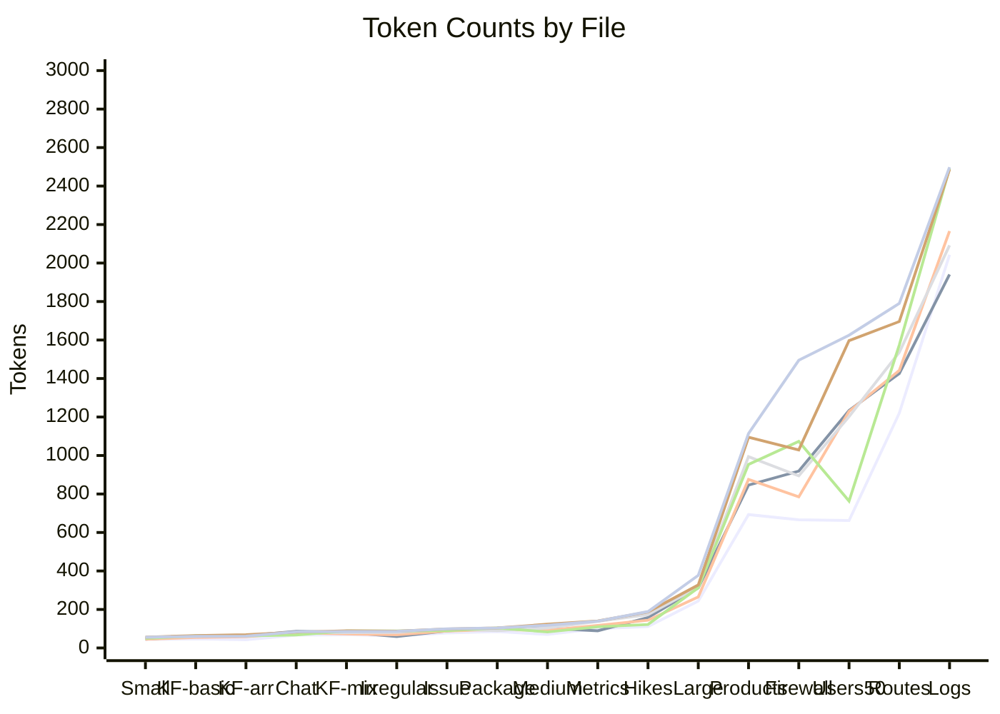

# Token Counts by Format

<!-- CHART_START -->

<!-- CHART_END -->

## Per-File Breakdown

| Format | Chat | Metrics | Large | Key-folding-mixed | Logs | Firewall | Small | Github-issue | Users-50 | Medium | Hikes | Package | Key-folding-basic | Irregular | Key-folding-with-array | Products | Routes | Total | Bytes |
|--------|------:|------:|------:|------:|------:|------:|------:|------:|------:|------:|------:|------:|------:|------:|------:|------:|------:|------:|------:|
| jot | 67 | 100 | 244 | 69 | 2043 | 666 | 44 | 78 | 662 | 70 | 111 | 85 | 47 | 63 | 43 | 693 | 1220 | 6305 | 16,228 |
| jsonito | 86 | 89 | 312 | 82 | 1941 | 919 | 45 | 89 | 1234 | 103 | 158 | 101 | 62 | 59 | 63 | 846 | 1426 | 7615 | 13,733 |
| lax | 79 | 117 | 265 | 73 | 2166 | 785 | 45 | 88 | 1229 | 92 | 144 | 95 | 55 | 69 | 58 | 876 | 1442 | 7678 | 20,595 |
| JSON (mini) | 76 | 117 | 266 | 78 | 2108 | 827 | 48 | 88 | 1279 | 97 | 158 | 97 | 58 | 68 | 58 | 866 | 1459 | 7748 | 23,119 |
| jot-pretty | 72 | 123 | 365 | 96 | 2259 | 1122 | 59 | 105 | 862 | 100 | 142 | 120 | 54 | 103 | 52 | 826 | 1518 | 7978 | 22,560 |
| d2 | 80 | 138 | 316 | 80 | 2092 | 894 | 55 | 97 | 1202 | 104 | 173 | 90 | 60 | 81 | 67 | 994 | 1536 | 8059 | 16,891 |
| toon | 68 | 110 | 313 | 88 | 2492 | 1073 | 50 | 90 | 763 | 83 | 122 | 104 | 63 | 88 | 63 | 954 | 1574 | 8098 | 22,380 |
| yaml | 82 | 140 | 327 | 89 | 2487 | 1029 | 56 | 98 | 1597 | 123 | 187 | 104 | 64 | 87 | 69 | 1095 | 1696 | 9330 | 26,366 |
| toml | 84 | 139 | 377 | 85 | 2498 | 1495 | 56 | 99 | 1625 | 118 | 189 | 104 | 60 | 86 | 61 | 1114 | 1790 | 9980 | 28,549 |
