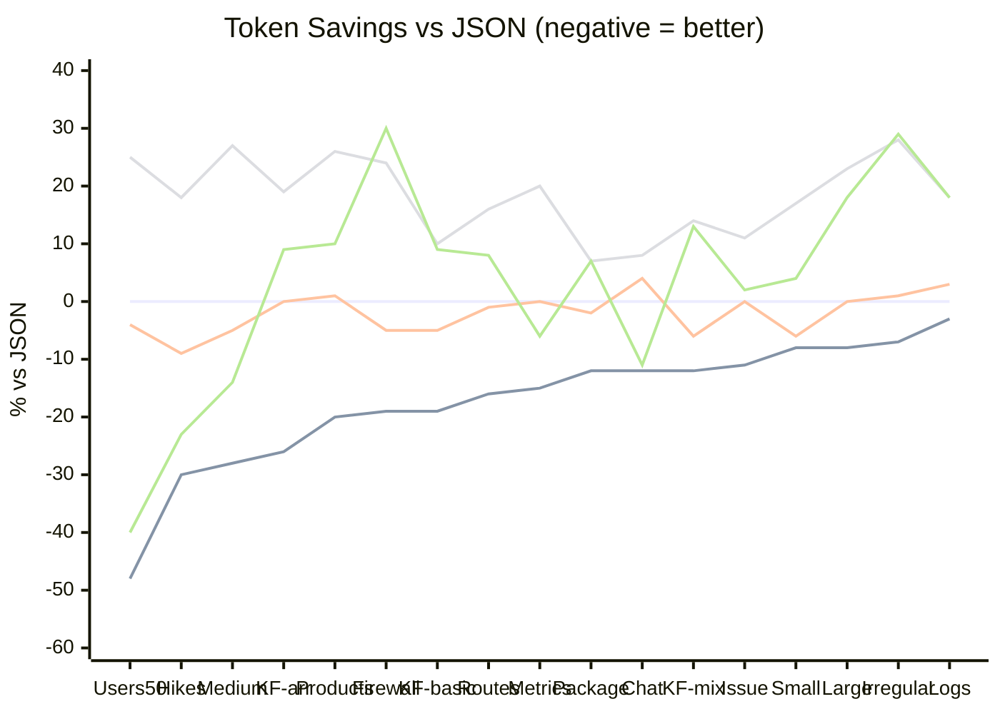
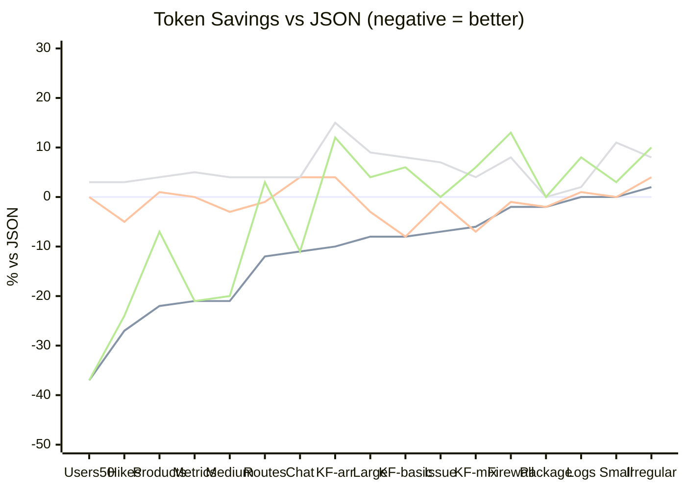
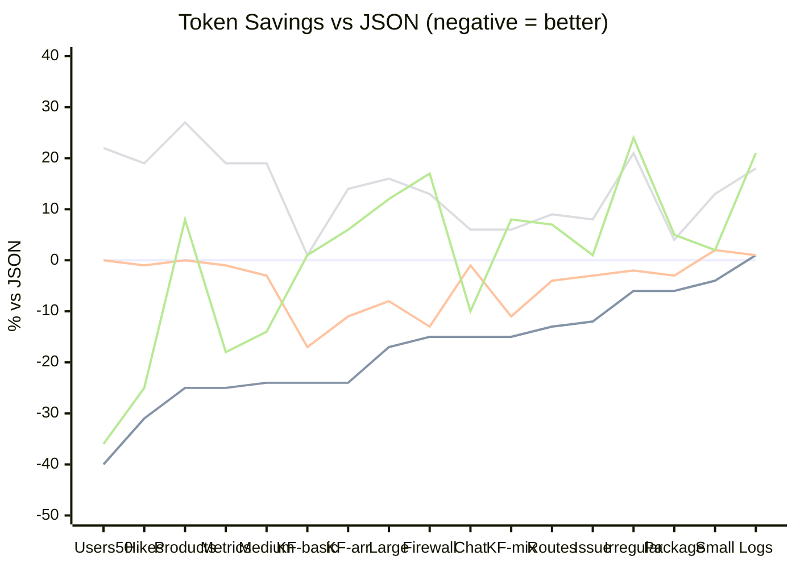

# Token Counts by Format

## Qwen Tokenizer (LM Studio)

Tokens measured using **Qwen3-Coder-30b** via LM Studio API. This is the primary tokenizer used for testing local model efficiency.

<!-- QWEN_CHART_START -->

<!-- QWEN_CHART_END -->

### Per-File Breakdown (Qwen)

<!-- QWEN_TABLE_START -->
<!-- QWEN_TABLE_END -->

---

## Legacy Claude Tokenizer

Tokens measured using **@anthropic-ai/tokenizer** (Claude's legacy tokenizer). This is the older tokenizer used by earlier Claude models.

<!-- LEGACY_CHART_START -->

<!-- LEGACY_CHART_END -->

### Per-File Breakdown (Legacy)

<!-- LEGACY_TABLE_START -->
| Format | Chat | Metrics | Large | KF-mix | Logs | Firewall | Small | Issue | Users50 | Medium | Hikes | Package | KF-basic | Irregular | KF-arr | Products | Routes | Total |
|--------|------:|------:|------:|------:|------:|------:|------:|------:|------:|------:|------:|------:|------:|------:|------:|------:|------:|------:|
| Jot | [62](jot/chat.jot) | [59](jot/metrics.jot) | [219](jot/large.jot) | [65](jot/key-folding-mixed.jot) | [1744](jot/logs.jot) | [824](jot/firewall.jot) | [36](jot/small.jot) | [67](jot/github-issue.jot) | [836](jot/users-50.jot) | [75](jot/medium.jot) | [102](jot/hikes.jot) | [91](jot/package.jot) | [45](jot/key-folding-basic.jot) | [49](jot/irregular.jot) | [47](jot/key-folding-with-array.jot) | [605](jot/products.jot) | [1332](jot/routes.jot) | 6,258 |
| Lax | [73](lax/chat.lax) | [75](lax/metrics.lax) | [232](lax/large.lax) | [64](lax/key-folding-mixed.lax) | [1771](lax/logs.lax) | [838](lax/firewall.lax) | [36](lax/small.lax) | [71](lax/github-issue.lax) | [1326](lax/users-50.lax) | [92](lax/medium.lax) | [132](lax/hikes.lax) | [91](lax/package.lax) | [45](lax/key-folding-basic.lax) | [50](lax/irregular.lax) | [54](lax/key-folding-with-array.lax) | [781](lax/products.lax) | [1494](lax/routes.lax) | 7,225 |
| JSON-m | [70](json/chat.json) | [75](json/metrics.json) | [239](json/large.json) | [69](json/key-folding-mixed.json) | [1750](json/logs.json) | [845](json/firewall.json) | [36](json/small.json) | [72](json/github-issue.json) | [1326](json/users-50.json) | [95](json/medium.json) | [139](json/hikes.json) | [93](json/package.json) | [49](json/key-folding-basic.json) | [48](json/irregular.json) | [52](json/key-folding-with-array.json) | [771](json/products.json) | [1516](json/routes.json) | 7,245 |
| YAML | [73](yaml/chat.yaml) | [79](yaml/metrics.yaml) | [260](yaml/large.yaml) | [72](yaml/key-folding-mixed.yaml) | [1780](yaml/logs.yaml) | [911](yaml/firewall.yaml) | [40](yaml/small.yaml) | [77](yaml/github-issue.yaml) | [1365](yaml/users-50.yaml) | [99](yaml/medium.yaml) | [143](yaml/hikes.yaml) | [93](yaml/package.yaml) | [53](yaml/key-folding-basic.yaml) | [52](yaml/irregular.yaml) | [60](yaml/key-folding-with-array.yaml) | [799](yaml/products.yaml) | [1572](yaml/routes.yaml) | 7,528 |
| TOON | [62](toon/chat.toon) | [59](toon/metrics.toon) | [249](toon/large.toon) | [73](toon/key-folding-mixed.toon) | [1885](toon/logs.toon) | [955](toon/firewall.toon) | [37](toon/small.toon) | [72](toon/github-issue.toon) | [836](toon/users-50.toon) | [76](toon/medium.toon) | [105](toon/hikes.toon) | [93](toon/package.toon) | [52](toon/key-folding-basic.toon) | [53](toon/irregular.toon) | [58](toon/key-folding-with-array.toon) | [720](toon/products.toon) | [1557](toon/routes.toon) | 6,942 |
<!-- LEGACY_TABLE_END -->

Note: The legacy tokenizer may produce different results than modern Claude models, but is useful for comparison and runs locally without API calls.

---

## Modern Claude Tokenizer

Tokens measured using **Claude API** token counting endpoint (claude-sonnet-4). This represents the actual token usage for modern Claude models. Token counting is free via the API.

<!-- CLAUDE_CHART_START -->

<!-- CLAUDE_CHART_END -->

### Per-File Breakdown (Claude)

<!-- CLAUDE_TABLE_START -->
| Format | Chat | Metrics | Large | KF-mix | Logs | Firewall | Small | Issue | Users50 | Medium | Hikes | Package | KF-basic | Irregular | KF-arr | Products | Routes | Total |
|--------|------:|------:|------:|------:|------:|------:|------:|------:|------:|------:|------:|------:|------:|------:|------:|------:|------:|------:|
| Jot | [69](jot/chat.jot) | [66](jot/metrics.jot) | [237](jot/large.jot) | [76](jot/key-folding-mixed.jot) | [1809](jot/logs.jot) | [869](jot/firewall.jot) | [44](jot/small.jot) | [76](jot/github-issue.jot) | [828](jot/users-50.jot) | [81](jot/medium.jot) | [113](jot/hikes.jot) | [99](jot/package.jot) | [53](jot/key-folding-basic.jot) | [59](jot/irregular.jot) | [53](jot/key-folding-with-array.jot) | [626](jot/products.jot) | [1477](jot/routes.jot) | 6,635 |
| Lax | [80](lax/chat.lax) | [87](lax/metrics.lax) | [263](lax/large.lax) | [79](lax/key-folding-mixed.lax) | [1823](lax/logs.lax) | [886](lax/firewall.lax) | [47](lax/small.lax) | [83](lax/github-issue.lax) | [1368](lax/users-50.lax) | [104](lax/medium.lax) | [162](lax/hikes.lax) | [102](lax/package.lax) | [58](lax/key-folding-basic.lax) | [62](lax/irregular.lax) | [62](lax/key-folding-with-array.lax) | [836](lax/products.lax) | [1637](lax/routes.lax) | 7,739 |
| JSON-m | [81](json/chat.json) | [88](json/metrics.json) | [286](json/large.json) | [89](json/key-folding-mixed.json) | [1798](json/logs.json) | [1022](json/firewall.json) | [46](json/small.json) | [86](json/github-issue.json) | [1369](json/users-50.json) | [107](json/medium.json) | [163](json/hikes.json) | [105](json/package.json) | [70](json/key-folding-basic.json) | [63](json/irregular.json) | [70](json/key-folding-with-array.json) | [839](json/products.json) | [1707](json/routes.json) | 7,989 |
| YAML | [86](yaml/chat.yaml) | [105](yaml/metrics.yaml) | [333](yaml/large.yaml) | [94](yaml/key-folding-mixed.yaml) | [2118](yaml/logs.yaml) | [1152](yaml/firewall.yaml) | [52](yaml/small.yaml) | [93](yaml/github-issue.yaml) | [1666](yaml/users-50.yaml) | [127](yaml/medium.yaml) | [194](yaml/hikes.yaml) | [109](yaml/package.yaml) | [71](yaml/key-folding-basic.yaml) | [76](yaml/irregular.yaml) | [80](yaml/key-folding-with-array.yaml) | [1063](yaml/products.yaml) | [1857](yaml/routes.yaml) | 9,276 |
| TOON | [73](toon/chat.toon) | [72](toon/metrics.toon) | [319](toon/large.toon) | [96](toon/key-folding-mixed.toon) | [2175](toon/logs.toon) | [1195](toon/firewall.toon) | [47](toon/small.toon) | [87](toon/github-issue.toon) | [879](toon/users-50.toon) | [92](toon/medium.toon) | [123](toon/hikes.toon) | [110](toon/package.toon) | [71](toon/key-folding-basic.toon) | [78](toon/irregular.toon) | [74](toon/key-folding-with-array.toon) | [907](toon/products.toon) | [1822](toon/routes.toon) | 8,220 |
<!-- CLAUDE_TABLE_END -->

Note: Run `ANTHROPIC_API_KEY=... bun scripts/count-claude-tokens.ts` to regenerate Claude counts.
